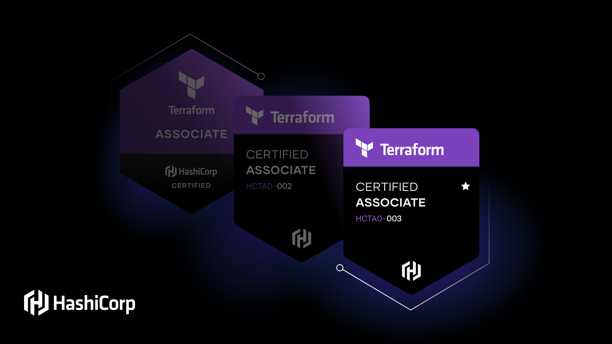

# Terraform Associate 2023
Master Terraform with a Hands-On Approach with 70+ AWS-based labs that follow the Terraform Associate 003 objectives.

The study notes are from **Udemy Course** [HashiCorp Certified: Terraform Associate - Hands-On Labs by Bryan Krausen](https://www.udemy.com/course/terraform-hands-on-labs/)

The Git Repo from the Udemy Couse is at [Terraform](https://github.com/btkrausen/hashicorp/tree/master/terraform)

**FreeCodeCamp** [Terraform Certified Associate (003) – How to Study for the Exam](https://www.freecodecamp.org/news/terraform-certified-associate-003-study-notes/)

## Objectives
**Reference:** [Terraform Associate (003) Exam Objectives](https://developer.hashicorp.com/certifications/infrastructure-automation)

|**1** |**Understand infrastructure as code (IaC) concepts**|
|:-----:|:--------------|
|1a	|_Explain what IaC is_|
|1b	|_Describe advantages of IaC patterns_| 

|**2**	|**Understand Terraform's purpose (vs other IaC)**|
|:-----:|:--------------|
|2a	|_Explain multi-cloud and provider-agnostic benefits_|
|2b	|_Explain the benefits of state_|

|**3**	|**Understand Terraform basics**|
|:-----:|:--------------|
|3a	|_Install and version Terraform providers_|
|3b	|_Describe plugin based architecture_|
|3c	|_Write Terraform configuration using multiple providers_|
|3d	|_Describe how Terraform finds and fetches providers_|

|**4**	|**Use the Terraform CLI (outside of core workflow)**|
|:-----:|:--------------|
|4a	|_Describe when to use `terraform import` to import existing infrastructure into your Terraform state_|
|4b	|_Use `terraform state` to view Terraform state_|
|4c	|_Describe when to enable verbose logging and what the outcome/value is_|

|**5**	|**Interact with Terraform modules**|
|:-----:|:--------------|
|5a	|_Contrast and use different module source options including the public Terraform Module Registry_|
|5b	|_Interact with module inputs and outputs_|
|5c	|_Describe variable scope within modules/child modules_|
|5d	|_Set module version_|

|**6**	|**Use the core Terraform workflow**|
|:-----:|:--------------|
|6a	|_Describe Terraform workflow ( Write -> Plan -> Create )_|
|6b	|_Initialize a Terraform working directory (`terraform init`)_|
|6c	|_Validate a Terraform configuration (`terraform validate`)_|
|6d	|_Generate and review an execution plan for Terraform (`terraform plan`)_|
|6e	|_Execute changes to infrastructure with Terraform (`terraform apply`)_|
|6f	|_Destroy Terraform managed infrastructure (`terraform destroy`)_|
|6g	|_Apply formatting and style adjustments to a configuration (`terraform fmt`)_|

|**7**	|**Implement and maintain state**|
|:-----:|:--------------|
|7a	|_Describe default `local` backend_|
|7b	|_Describe state locking_|
|7c	|_Handle backend and cloud integration authentication methods_|
|7d	|_Differentiate remote state back end options_|
|7e	|_Manage resource drift and Terraform state_|
|7f	|_Describe `backend` block and cloud integration in configuration_|
|7g	|_Understand secret management in state files_|

|**8**	|**Read, generate, and modify configuration**|
|:-----:|:--------------|
|8a	|_Demonstrate use of variables and outputs_|
|8b	|_Describe secure secret injection best practice_|
|8c	|_Understand the use of collection and structural types_|
|8d	|_Create and differentiate `resource` and `data` configuration_|
|8e	|_Use resource addressing and resource parameters to connect resources together_|
|8f	|_Use HCL and Terraform functions to write configuration_|
|8g	|_Describe built-in dependency management (order of execution based)_|

|**9**	|**Understand Terraform Cloud Capabilities**|
|:-----:|:--------------|
|9a	|_Explain how Terraform Cloud helps to manage infrastructure_|
|9b	|_Describe how Terraform Cloud enables collaboration and governance_|
