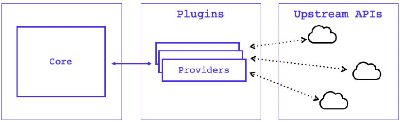

# Terraform Plug-in Based Architecture
- Terraform is built on a _plugin-based architecture_, enabling developers to extend Terraform by **writing new plugins** or **compiling modified versions of existing plugins**.
- Terraform is _**logically**_ split into two main parts: `Terraform Core` and `Terraform Plugins`.
  - `Terraform Core` **uses remote procedure calls (RPC) to communicate with** `Terraform Plugins` and offers multiple ways to _discover_ and _load_ plugins to use.
  - `Terraform Plugins` **expose an implementation for a specific service**, such as _AWS_, or **provisioner**, such as _bash_.
## Terraform Core
- Terraform `Core` is a _statically-compiled binary_ written in the `Go` programming language. The **compiled** binary is the _command line tool (CLI)_ `terraform`, the _entrypoint_ for anyone using Terraform.
- **Primary Responsibilities**
  - **Infrastructure as code**: reading and interpolating configuration files and modules
  - **Resource state management**
  - **Construction of the Resource Graph**
  - **Plan Execution**
  - **Communication with `Plugins` over RPC.**
- Terraform `Core` provides a **high-level framework** that **abstracts away** the details of `plugin` discovery and _RPC communication_ so developers do not need to manage either.

## Terraform Plugins
- Are **executable** binaries _invoked by Terraform Core over RPC_.
-  Terraform has _several `Provisioners` **built-in**_, while `Providers` are **discovered dynamically** as needed.
- Terraform relies on `plugins` called **`providers`** to **interact** with _remote_ systems and expand functionality.
- **Primary Responsibilities**
  - **`Provider` Plugin**
    - _**Initialization**_ of any _included libraries used to make API calls_
    - **Authentication** _with the Infrastructure Provider_
    - **Define Resources** _that map to specific Services_.
  - **`Provisioner` Plugins**
    - Executing commands or scripts on the designated Resource after creation, or on destruction.

  

## Providers
- The special `terraform` configuration block is used to configure behaviour of Terraform itself.
  ```yaml
  terraform {
    # terraform core version
    required_version = ">= 0.13.0"
    # Define provider
    required_providers {
      aws = {
        # source as hashicorp aws registry
        source = "hashicorp/aws"
        #
        version = "~> 3.0"
      }
    }
  }  
  ```
- The **`required_version`** setting accepts a _version constraint string_, which specifies **_which versions of Terraform can be used with your configuration_**.
- The **`required_providers`** block specifies **all of the providers** required by the current module, _mapping each local provider name to a source address and a version constraint_.
  - **`source`** defines the **global source address** for the provider intended to use.
    - it is its **global identifier** and also specifies the **primary location** where Terraform can download it.
  - **`version`** is a **version constraint** specifying which subset of available `provider versions` the **module is compatible with**.

### View installed and required providers
- `terraform version` & `terraform providers` command will show list of providers installed.
  ```shell
  ➜  terraform version
  Terraform v1.5.6
  on darwin_arm64
  + provider registry.terraform.io/hashicorp/aws v3.76.1
  
  Your version of Terraform is out of date! The latest version
  is 1.5.7. You can update by downloading from https://www.terraform.io/downloads.html
  ➜ 
  
  ➜  terraform providers
  
  Providers required by configuration:
  .
  └── provider[registry.terraform.io/hashicorp/aws] ~> 3.0
  
  ➜  
  ```
## References
- [How Terraform Works With Plugins](https://developer.hashicorp.com/terraform/plugin/how-terraform-works)
- [Provider Requirements](https://developer.hashicorp.com/terraform/language/providers/requirements)
